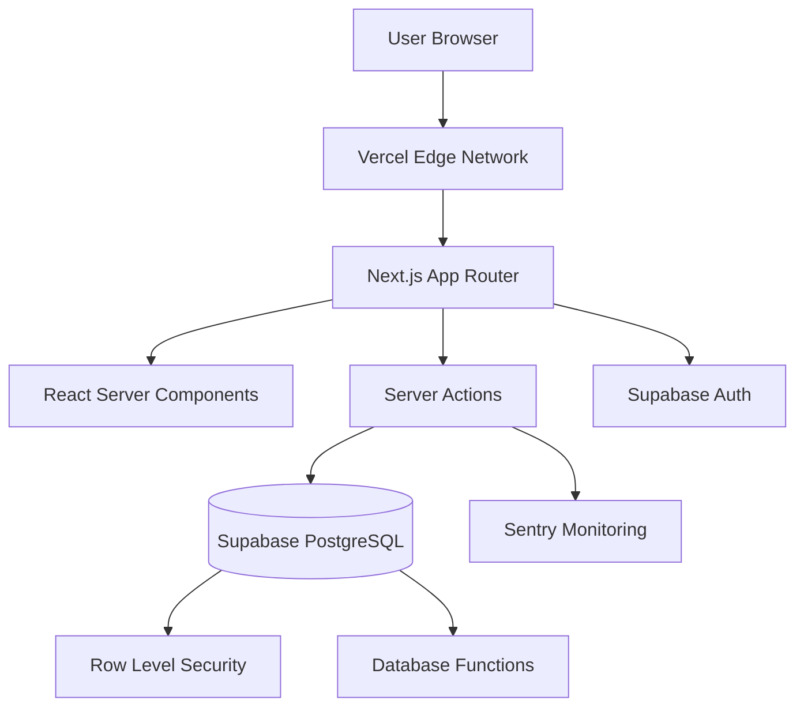
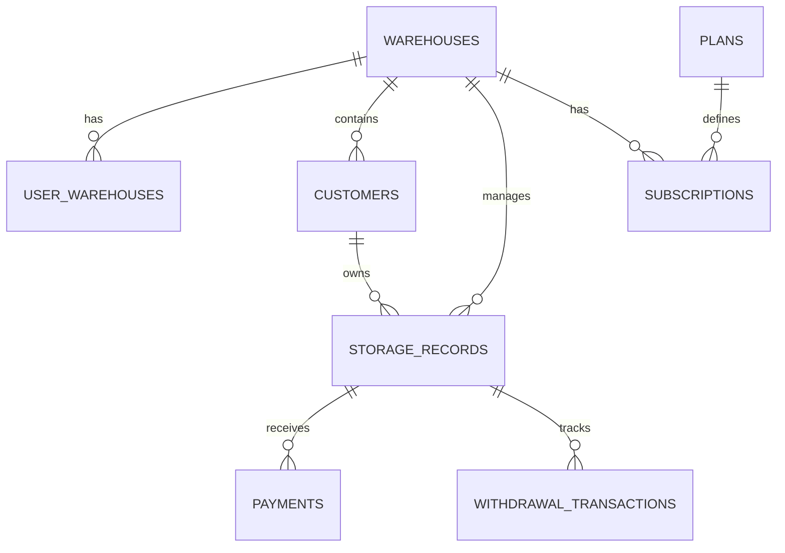

# Architecture Overview

## System Design

BagBill is a multi-tenant, cloud-native Warehouse Management System built with a modern serverless architecture. The application follows a **Server-Side Rendering (SSR)** approach with **React Server Components** for optimal performance and SEO.

### High-Level Architecture



---

## Technology Stack

### Frontend Layer

| Technology       | Version | Purpose                         |
| ---------------- | ------- | ------------------------------- |
| **Next.js**      | 16.x    | React framework with App Router |
| **React**        | 19.x    | UI library with RSC support     |
| **TypeScript**   | 5.x     | Type-safe development           |
| **Tailwind CSS** | 3.x     | Utility-first styling           |
| **Shadcn/UI**    | Latest  | Component library               |
| **Lucide React** | Latest  | Icon system                     |

### Backend & Data Layer

| Technology         | Version    | Purpose                    |
| ------------------ | ---------- | -------------------------- |
| **Supabase**       | Latest     | PostgreSQL database + Auth |
| **PostgreSQL**     | 17.x       | Relational database        |
| **Zod**            | Latest     | Schema validation          |
| **Server Actions** | Next.js 16 | Form handling & mutations  |

### DevOps & Monitoring

| Technology         | Purpose                                 |
| ------------------ | --------------------------------------- |
| **Vercel**         | Hosting & deployment                    |
| **Sentry**         | Error tracking & performance monitoring |
| **GitHub Actions** | CI/CD pipeline                          |
| **Playwright**     | E2E testing                             |
| **Vitest**         | Unit testing                            |

---

## Folder Structure

```
rent_supabase/
├── src/
│   ├── app/                    # Next.js App Router pages
│   │   ├── (dashboard)/        # Protected routes (layout authenticated)
│   │   │   ├── page.tsx        # Dashboard home
│   │   │   ├── customers/
│   │   │   ├── storage/
│   │   │   ├── inflow/
│   │   │   ├── outflow/
│   │   │   ├── payments/
│   │   │   ├── expenses/
│   │   │   └── settings/
│   │   ├── (public)/           # Public routes (no auth required)
│   │   │   ├── login/
│   │   │   └── pricing/
│   │   └── layout.tsx          # Root layout
│   ├── components/             # React components
│   │   ├── ui/                 # Shadcn UI primitives
│   │   ├── shared/             # Reusable components
│   │   ├── layout/             # Layout components (sidebar, header)
│   │   ├── customers/          # Customer-specific components
│   │   ├── storage/
│   │   ├── payments/
│   │   └── settings/
│   ├── lib/                    # Core business logic
│   │   ├── actions/            # Server actions (mutations)
│   │   ├── queries/            # Data fetching functions
│   │   ├── billing.ts          # Rent calculation logic
│   │   ├── definitions.ts      # TypeScript types
│   │   ├── utils.ts            # Utility functions
│   │   └── constants.ts        # App constants
│   ├── contexts/               # React contexts
│   ├── hooks/                  # Custom React hooks
│   └── utils/                  # Utility modules
│       └── supabase/           # Supabase client configs
├── supabase/
│   └── migrations/             # Database migrations (chronological)
├── tests/                      # E2E tests (Playwright)
├── docs/                       # Documentation
└── public/                     # Static assets
```

---

## Data Flow Patterns

### 1. Read Pattern (Server Component)

```typescript
// app/customers/page.tsx - Server Component
export default async function CustomersPage() {
  const customers = await getCustomers(); // Direct DB query

  return <CustomerList customers={customers} />;
}
```

**Flow:**

```
User Request → Next.js Server → getCustomers() → Supabase (with RLS) → Render RSC → HTML to Browser
```

### 2. Write Pattern (Server Action)

```typescript
// lib/actions/customers.ts - Server Action
"use server";

export async function addCustomer(prevState: FormState, formData: FormData) {
  // 1. Validate input
  const validated = CustomerSchema.safeParse(formData);

  // 2. Check permissions (RLS handles database-level)
  const user = await getUser();

  // 3. Mutate database
  const { error } = await supabase.from("customers").insert(data);

  // 4. Revalidate cache
  revalidatePath("/customers");

  return { success: !error };
}
```

**Flow:**

```
Form Submit → Server Action → Validation → RLS Check → DB Insert → Revalidate Cache → Re-render Component
```

### 3. Authentication Flow

```
Login Request → Supabase Auth → Set Cookie → Middleware Check → Allow/Deny Route Access
```

---

## Key Architectural Patterns

### 1. Row Level Security (RLS)

**All database access is secured via RLS policies:**

```sql
-- Example: Users only see customers from their warehouse
CREATE POLICY "Users see own warehouse customers" ON customers
  FOR SELECT USING (
    warehouse_id IN (
      SELECT warehouse_id FROM user_warehouses
      WHERE user_id = auth.uid()
    )
  );
```

**Benefits:**

- ✅ Database-level security (can't be bypassed)
- ✅ Multi-tenant isolation without app logic
- ✅ Centralized access control

### 2. Server Components First

**Default to Server Components, use Client Components only when needed:**

```typescript
// ✅ Server Component (Default)
export default async function Page() {
  const data = await getData();
  return <DataDisplay data={data} />;
}

// ❌ Only use 'use client' when you need:
// - useState, useEffect, event handlers
// - Browser APIs
// - Real-time interactivity
```

### 3. Optimistic UI Updates

**Pattern used in forms for instant feedback:**

```typescript
"use client";

export function CustomerForm() {
  const [optimisticCustomers, addOptimisticCustomer] = useOptimistic(
    customers,
    (state, newCustomer) => [...state, newCustomer]
  );

  // UI updates immediately, server action runs in background
}
```

### 4. Type Safety End-to-End

```typescript
// Database types generated from Supabase
type Customer = Database["public"]["Tables"]["customers"]["Row"];

// Zod schemas for validation
const CustomerSchema = z.object({
  name: z.string().min(1),
  phone: z.string().regex(/^\d{10}$/),
});

// Ensures type consistency from DB → Server → Client
```

---

## Database Architecture

### Schema Design Principles

1. **Normalization**: Proper foreign keys between all tables
2. **Audit Trail**: All tables have `created_at`, `updated_at`
3. **Soft Deletes**: Critical data uses soft delete pattern
4. **JSONB for Flexibility**: `features` columns for dynamic data

### Key Tables



### Sequences Table

**Custom ID generation for human-readable references:**

```typescript
// AUTO-GENERATED IDs:
REC - 1001; // Storage Record
PAY - 505; // Payment
OUT - 302; // Outflow Invoice
```

---

## Security Architecture

### Multi-Layer Security Model

```
Layer 1: Vercel Edge (DDoS, SSL/TLS)
         ↓
Layer 2: Next.js Middleware (Auth check, redirect)
         ↓
Layer 3: Server Actions (Input validation, rate limiting)
         ↓
Layer 4: Supabase RLS (Row-level access control)
         ↓
Layer 5: Database Constraints (Foreign keys, check constraints)
```

### Role-Based Access Control (RBAC)

| Role            | Permissions                                       |
| --------------- | ------------------------------------------------- |
| **Super Admin** | Full system access, manage subscriptions          |
| **Owner**       | Warehouse owner, all warehouse operations         |
| **Admin**       | Warehouse manager, all operations except settings |
| **Manager**     | Can view reports, manage stock                    |
| **Staff**       | Basic operations (inflow, outflow, payments)      |
| **Customer**    | View own records only                             |

**Implemented via:**

- `profiles.role` column
- RLS policies checking `auth.uid()` role
- Conditional UI rendering

---

## Performance Optimizations

### 1. Database Indexing

```sql
-- Composite indexes for common queries
CREATE INDEX idx_storage_active_records
  ON storage_records(warehouse_id, storage_end_date DESC)
  WHERE storage_end_date IS NULL;

-- Full-text search
CREATE INDEX idx_customers_search
  ON customers USING gin(to_tsvector('english', name));
```

### 2. Query Optimization

**Pagination implemented at database level:**

```typescript
// Avoid fetching all records
const { data, count } = await supabase
  .from("storage_records")
  .select("*", { count: "exact" })
  .range(start, end) // Fetch only page data
  .order("created_at", { ascending: false });
```

### 3. Edge Caching

**Static pages cached at Vercel Edge:**

```typescript
// app/pricing/page.tsx
export const revalidate = 3600; // Cache for 1 hour
```

### 4. React Server Components

**Reduces JavaScript bundle size:**

- ✅ No client-side re-rendering for static data
- ✅ Direct database queries (no API calls)
- ✅ Automatic code splitting

---

## State Management Strategy

### Server State (Preferred)

**Data fetched on server, no client-side state needed:**

```typescript
// ✅ Server-fetched data passed as props
export default async function Page() {
  const data = await getData();
  return <ClientComponent data={data} />;
}
```

### Client State (When Necessary)

1. **React Context** - For global UI state (theme, warehouse selection)
2. **useState** - For form inputs, UI toggles
3. **useOptimistic** - For optimistic updates
4. **URL State** - For filters, pagination (searchParams)

**No Redux/Zustand** - Server components eliminate most client state needs

---

## Error Handling Strategy

### 1. Server-Side Errors

```typescript
try {
  await mutateData();
} catch (error) {
  // Log to Sentry with context
  Sentry.captureException(error, {
    tags: { operation: "add_customer" },
    user: { id: userId },
  });

  // Return generic message to client
  return { error: "Operation failed" };
}
```

### 2. Client-Side Errors

```typescript
// Error boundaries for React errors
export default function ErrorBoundary({ error }: { error: Error }) {
  useEffect(() => {
    Sentry.captureException(error);
  }, [error]);

  return <ErrorUI />;
}
```

### 3. Database Errors

**RLS violations automatically caught and logged:**

```typescript
// Supabase client configured with Sentry integration
const supabase = createClient({
  onError: (error) => Sentry.captureException(error),
});
```

---

## Testing Strategy

### 1. Unit Tests (Vitest)

**Business logic tested in isolation:**

```typescript
// lib/billing.test.ts
describe("calculateFinalRent", () => {
  it("calculates 6-month storage correctly", () => {
    const result = calculateFinalRent(record, endDate, bags);
    expect(result.finalRent).toBe(expectedAmount);
  });
});
```

### 2. Integration Tests

**Server actions tested with mocked Supabase:**

```typescript
// test/security-actions.test.ts
test("blocks unauthorized deletion", async () => {
  const result = await deleteStorageRecord(recordId);
  expect(result.success).toBe(false);
});
```

### 3. E2E Tests (Playwright)

**Full user flows tested:**

```typescript
// tests/full-regression.spec.ts
test("complete inflow-outflow-payment flow", async ({ page }) => {
  await login(page);
  await createInflow(page);
  await processOutflow(page);
  await recordPayment(page);
  // ... assertions
});
```

---

## Deployment Architecture

```
GitHub → GitHub Actions (CI) → Vercel (CD) → Edge Network
                  |
                  ├─ npm run lint
                  ├─ npm run typecheck
                  ├─ npm run test
                  └─ npm run build
```

**Environments:**

- **Development** - Local (`npm run dev`)
- **Staging** - Vercel preview deployments
- **Production** - Vercel production (auto-deploy from main branch)

---

## Monitoring & Observability

### Metrics Tracked

1. **Error Monitoring** (Sentry)

   - Exception tracking
   - Performance monitoring
   - User session replay

2. **Performance** (Vercel Analytics)

   - Core Web Vitals
   - Page load times
   - API response times

3. **Database** (Supabase Dashboard)
   - Query performance
   - Connection pool usage
   - Disk usage

---

## Design Principles

### 1. Security First

- All queries go through RLS
- Input validation on server (never trust client)
- Principle of least privilege for roles

### 2. Performance Second

- Server components reduce bundle size
- Database queries optimized with indexes
- Edge caching for static content

### 3. Developer Experience

- TypeScript everywhere
- Clear folder structure
- Comprehensive error messages

### 4. User Experience

- Optimistic UI updates
- Loading states with skeletons
- Mobile-first responsive design

---

## Migration Strategy

**Database changes follow migration pattern:**

1. Create migration file: `supabase/migrations/YYYYMMDD_description.sql`
2. Test locally
3. Apply to staging
4. Verify functionality
5. Apply to production

**Critical:** Never delete migrations, only add new ones

---

## Scaling Considerations

### Current Limits

- Supabase free tier: 500MB database
- Vercel free tier: 100GB bandwidth
- Expected load: <1000 concurrent users

### Scaling Strategy

**When hitting limits:**

1. **Database** - Upgrade Supabase plan (vertical scaling)
2. **Compute** - Vercel auto-scales (serverless)
3. **Caching** - Add Redis for session storage
4. **CDN** - Cloudflare for static assets

---

## API Design (Future)

**Currently using Server Actions, future REST API:**

```
/api/v1/
  ├── /customers
  ├── /storage
  ├── /payments
  └── /reports
```

**Authentication:** JWT tokens from Supabase Auth  
**Rate Limiting:** 100 requests/minute per API key

---

## Decision Log

### Why Next.js App Router over Pages Router?

- ✅ Native Server Components support
- ✅ Simplified data fetching (no getServerSideProps)
- ✅ Better performance (less JavaScript shipped)

### Why Supabase over Custom PostgreSQL?

- ✅ Built-in authentication
- ✅ Row Level Security out of box
- ✅ Automatic API generation
- ✅ Real-time subscriptions available

### Why Server Actions over API Routes?

- ✅ Type-safe end-to-end
- ✅ Less boilerplate
- ✅ Automatic revalidation
- ✅ Better DX with progressive enhancement

---

**Last Updated:** January 5, 2026  
**Version:** 1.0  
**Maintainer:** Development Team
